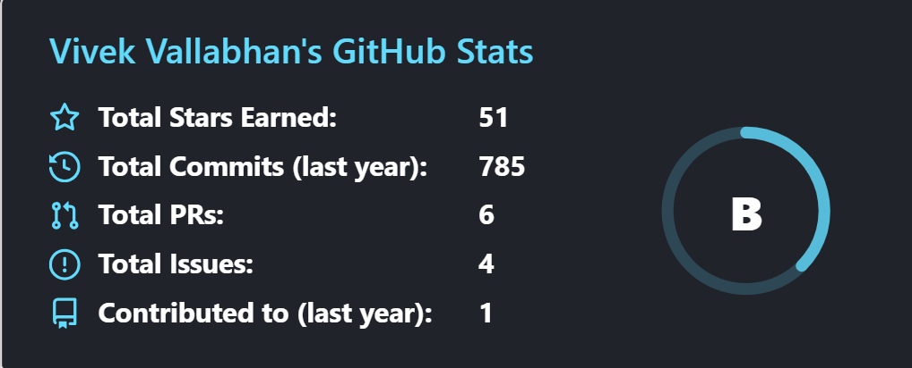
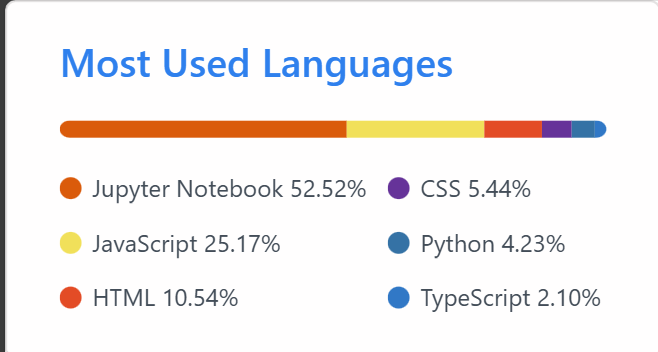
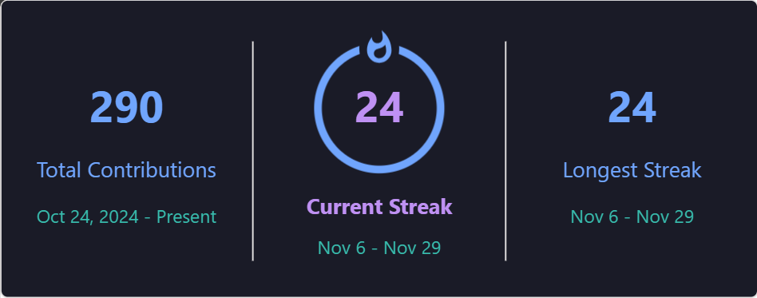

<!-- Profile Header -->

  

---

## 🧑‍💻 About Me
I'm a **Computer Science student** focused on **Web Development and AI/ML**.  
I love developing solutions that have real-life impact and writing clean code that helps others understand these solutions.

- 🎯 Interested in software applications with real-life purpose  
- 💡 Building projects that combine analytics and design  
- 🔍 Learning: NextJs,GraphQL and Backend Development  
- Learning System Design Concepts.

---

## 🔗 Connect With Me

---

## 🧠 Tech Stack

### Programming & Scripting

### Web Development

### Data Science & ML

### Development & Tools

---

## 📊 GitHub Insights

  
  

---

---

### 🏅 GitHub Achievements

<table align="center">
  <tr>
    <td align="center">
       
      <b>Pull Shark</b>
    </td>
    <td align="center">
       
      <b>YOLO</b>
    </td>
    <td align="center">
       
      <b>Quickdraw</b>
    </td>
  </tr>
</table>

---

## Random Dev Quote

### 📜 Favorite Developer Quote  

  

## 📫 Reach Me
📧 **Email:** vvivek.1804@gmail.com  
🌐 **Portfolio:** [vivek-vallabhan-portfolio.onrender.com](https://vivek-vallabhan-portfolio.onrender.com/)

---

⭐ *Thanks for visiting! Feel free to explore my repositories and projects. You can contact me from the email provided above.*
